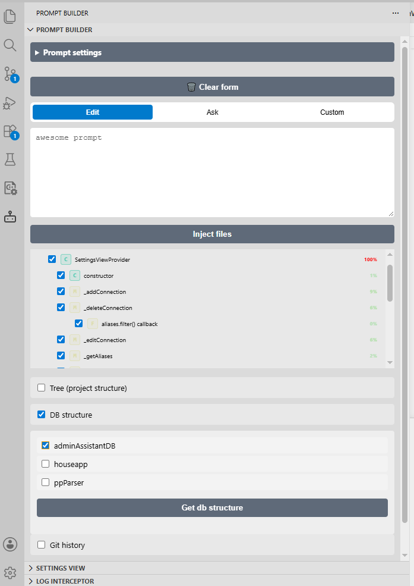
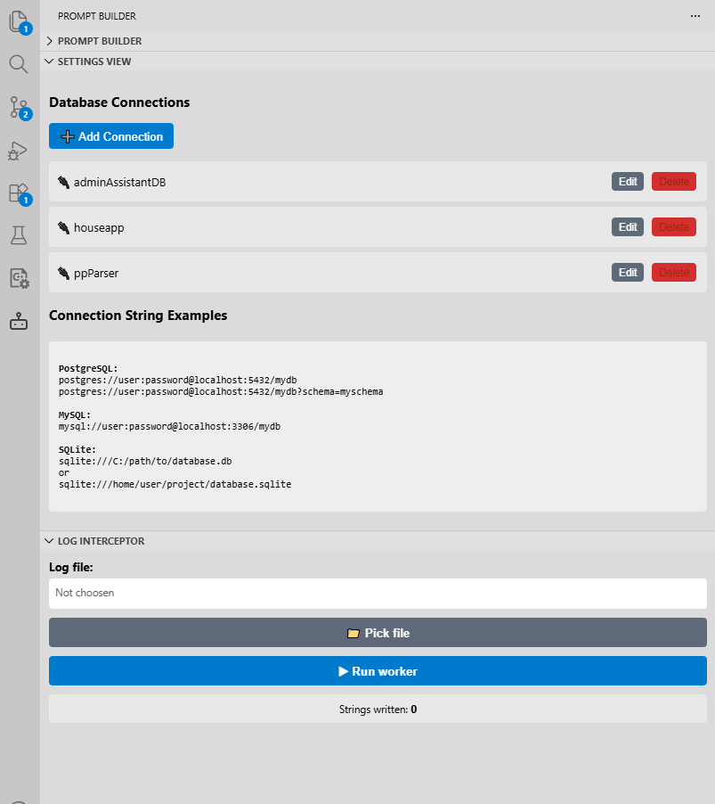

# chatcontextmanager README

Barebones prompt constructor. Made to make life without full blown coding agents easier
https://github.com/gorohovAv/chatcontextmanager
https://marketplace.visualstudio.com/items?itemName=Eggplant11.chatcontextmanager

## Features

- system and project prompts
- project structure injection
- full and partial file injection
- database structure injecting
- git history injecting
- log intercepting

## Screenshots

