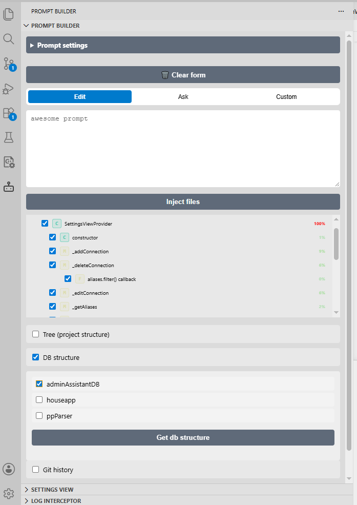
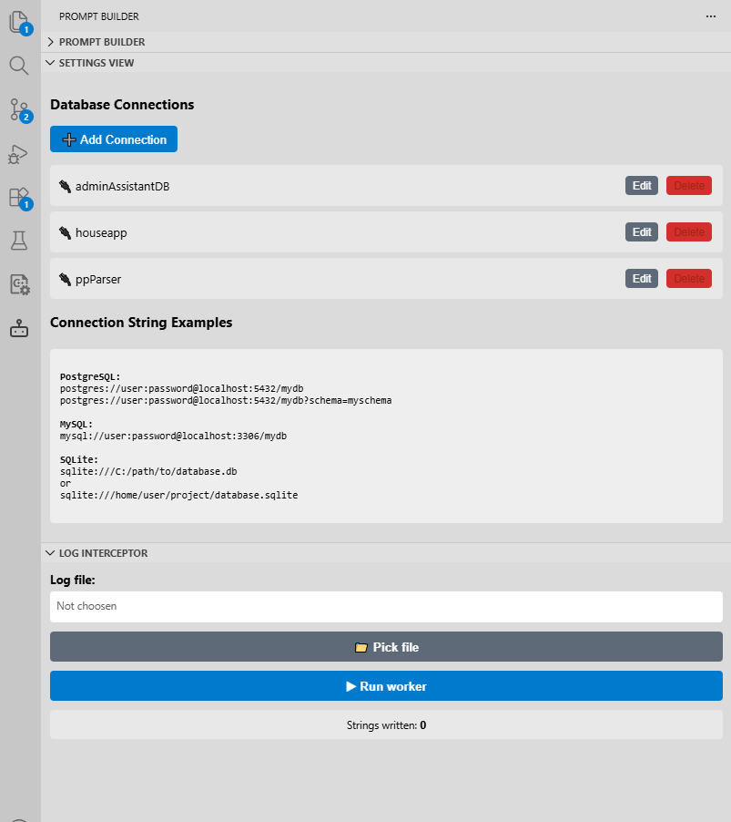

# chatcontextmanager README

Barebones prompt constructor. Made to make life without full blown coding agents easier
https://github.com/gorohovAv/chatcontextmanager
https://marketplace.visualstudio.com/items?itemName=Eggplant11.chatcontextmanager

## Features

- system and project prompts
- project structure injection
- full and partial file injection; you can inject separate functions, classes, etc
- database structure injecting
- git history injecting
- log intercepting; write every log to a file to stop fighting with terminal buffer
- figma fetching; fetch layout -> convert to a minimal md -> inject to a context as a file
- xml diff accepting; edit your system prompt -> get xml -> accept all changes to your codebase in one move

## Screenshots

